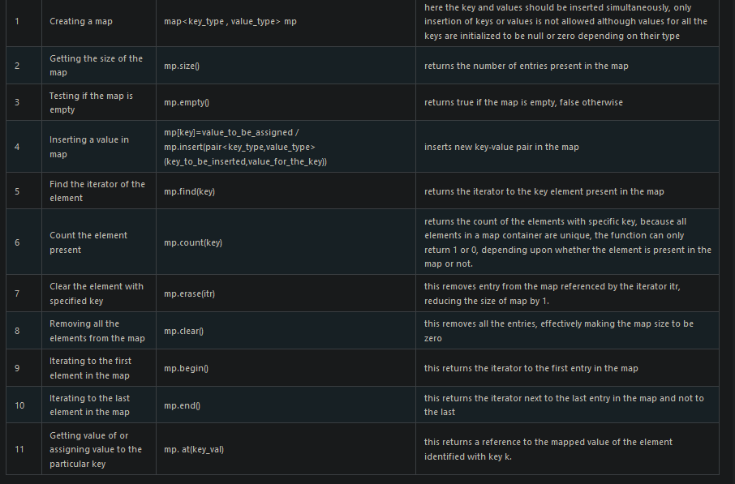
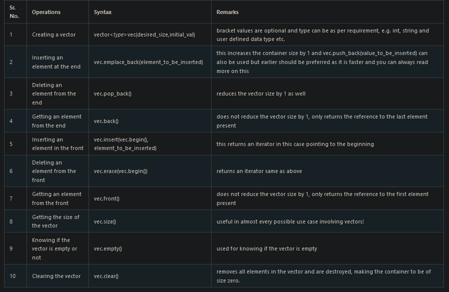
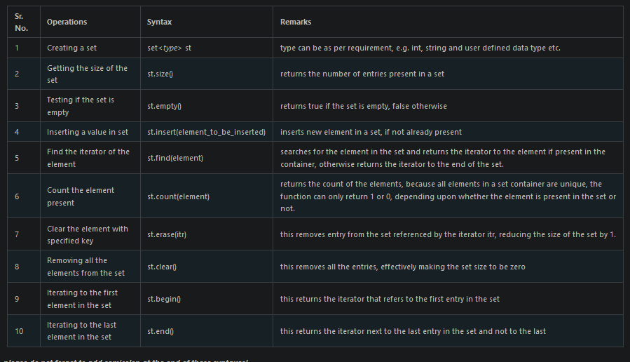
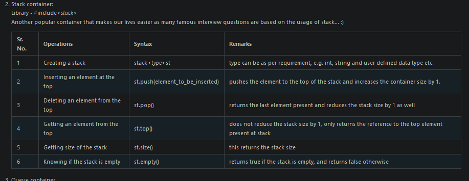
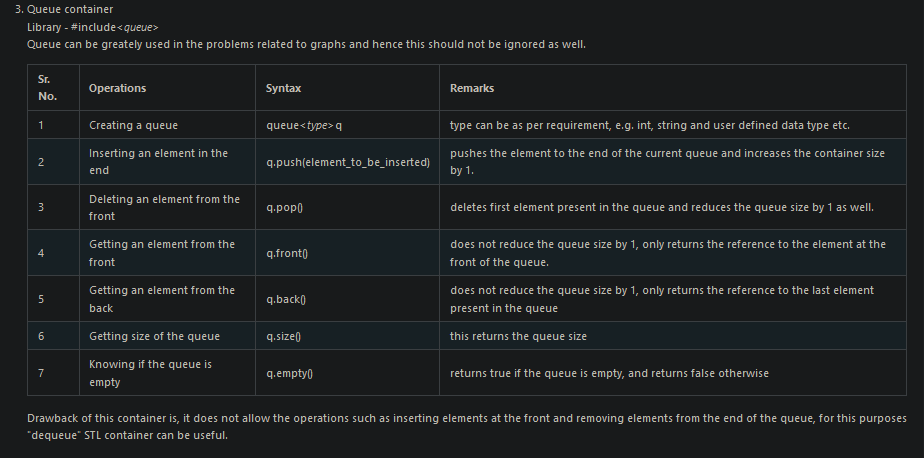
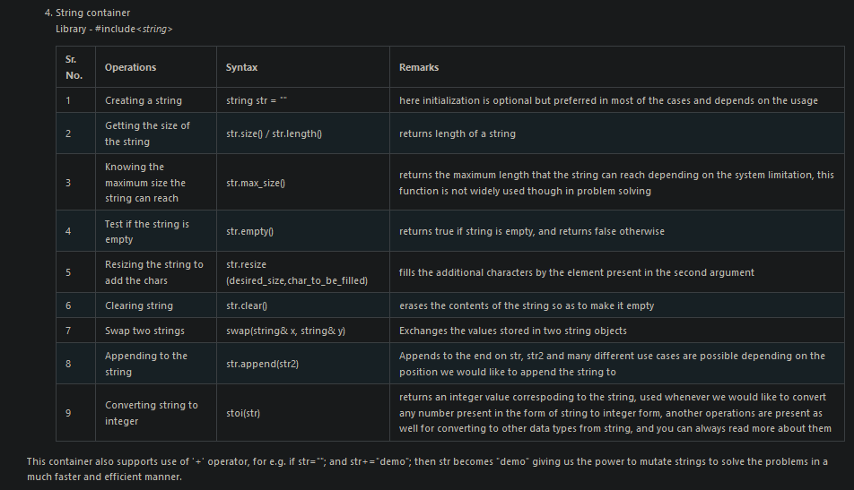

# Hash Map

```cpp
map<string, pair<int, int>> myMap;

for (auto it = myMap.begin(); it != myMap.end(); ++it)
		{

			// std::cout << it->second.first << " " << it->second.second << std::endl;
			v.push_back(it->second.first); // the second item here is a pair. so we are accessing first of that second
			v.push_back(it->second.second);
		}


  if (myMap.find(key) == myMap.end())	{
				myMap.insert({key, {i, j}});
			}


    for(const auto& num : map1){
        if(num.second == 2) ans.push_back(num.first);
    }

     for(int i : nums) map1[i]++; // find occurences
```


# Vectors

```cpp
  vector<int> ans(2 * n);
  vector<long long> nums(n);

  // create with some initial data
  vector<vector<int>> res = { {1, 2, 3}, {2, 5, 6}, {1, 2, 3} };

  // create with specific no of rows
  vector<int> result(height.size() * height.size());

  // create with specific no of rows but no specific cols
  vector<vector<int>> ans(2, vector<int>());
  vector<vector<int>> edges(V, vector<int>());

// create with specific no of rows and cols
  vector<vector<int>> nums(n, vector<int>(n));

   // creating a 2d matrix with all the enteries as 0. we have +1 row and +1 col here too. 
   vector<vector<int>> dp(matrix.size() + 1, vector<int>(matrix[0].size() + 1, 0)); 

// create with some initial dummy data for all the enteries
  vector<int> v(5,20); // {20,20,20,20,20}

 cout << v1.at(0); // same as v[0]

// dealoing with matrices
  int row = image.size();
  int col = image[0].size();
  vector<vector<int>> ans(row, vector<int>(col));

// vector of pairs
  vector<pair<int, int>> ans;
  ans.push_back({c, i}); 

    // copy ans vector into nums
    copy(ans.begin(), ans.end(), nums.begin());         
    // reseize a vector to a new size
    nums.resize(n);

  ```

# Sets


# Stack



# Queue


# String


# Graph
- creating an adjacency matrix
  ```
   vector<vector<int>> times = { {1,1,1}  ,{2,1,3} ,{3,4,1} };
   unordered_map<int, vector<pair<int, int>>> map;

    for (vector<int> data : times) {
        map[data[0]].push_back({ data[1], data[2] });
    }

  ```


# Iteration shortcut 
  ```cpp  
 for (auto n : nums){
    }
    // works for sets too
```


# Pairs 
  ```cpp  
//   use as a function
 pair<int, int> diameterFast(TreeNode *root)
    {
        // base case
        if (root == NULL)
        {
            pair<int, int> p = make_pair(0, 0);
            return p;
        }

        return ans;
    }

    // normal use 
     pair<int, int> result = diameterFast(root);

```
# STL 
C++ STL: [pdf Drive link](https://drive.google.com/file/d/13b461lxGsYuF-9cCz-nzhf_KhFLdw3hx/view)

## creating pairs
```cpp
    pair<int, int> p = { 1,2 };
    cout << p.first << " " << p.second;
  ```
  
##  pairs of pairs
```cpp
    pair<int, pair<int, int>> p2 =  {1, { 3 , 4 }};
    cout << p2.first << " " << p2.second.second;
  ```
##  pairs of arrays
```cpp
    pair<int, int> arr[] = { {1,2}, {3,4} };
    cout << arr[1].second;
  ```
  
##  vector of pairs
```cpp
    vector<pair<int, int>> vec;
    vec.push_back({ 2,7 });
    vec.emplace_back( 2,10 );
    cout << vec[0].second;
  ```

##  copying a vector
```cpp
   vector<int> v1 = {1,2,3};
   vector<int> v2(v1);
  ```  
##  Iterators
```cpp
   vector<int> v1 = {1,2,3};
   vector<int>::iterator it = v1.begin();
   it += 2;
   cout << *(it);
  ```
##  erase a vector
```cpp
    vector<int> v1 = {1111,2,321,3,4,5};
    v1.erase(v1.begin() + 2, v1.begin() + 4);
    
  ```
##  inserting in a vector
```cpp
    v1.insert(v1.begin(). 300); // insert a vector
    v1.insert(v1.begin(), copy.begin(), copy.end()) // insert a vector named copy in v1

  ```
##  swapping a vector
```cpp
  v1.swap(v2)
  ```
##  List
```cpp
      list<int> ls;
    ls.push_back(2);
    ls.emplace_back(4);
    ls.push_front(6);
    // output {6,2,4}
    // rest func same as vec

  ```

##  swap stack
```cpp
  st1.swap(st2);
  ```
##  priority queue
```cpp
   pq.push(5);
    pq.push(1);
    pq.push(5);
    pq.push(3);
    // output {5, 3, 5, 1}
  ```

##  min heap
```cpp
    priority_queue<int, vector<int>, greater<int>> pq;
    pq.push(5);
    pq.push(1);
    pq.push(5);
    pq.push(3);
    pq.push(1);
    pq.push(3);
    pq.push(3);
    pq.push(3);

    // output {1 1 3 3 3 5 3 5}  
  ```
## find in set
```cpp
    auto it = st.find(6)

    if(st.find(x) != st.find(6)); // if true element is present in the set

    // another way
    unordered_set<int> visited;
    if (visited.count(n)) ; // the number exists in the set

    set<int> st = { 1, 2, 3, 4, 5, 6};
    auto it = st.find(5);
    cout << *(it);

    // Another way
    set<int> sett = { 1, 2, 3, 4, 5, 6};
    int a = 5;
    if (sett.count(5) > 0) cout << "present in the set"; // it returns 1 if the elemnt is present and 0 if not
```
## delete a range in set
```cpp
    auto it1 = st.find(1);
    auto it2 = st.find(5);
    st.erase(it1, it2);
```

- NOTE: STL done till multiset. will do the rest later on


# important functions
```cpp
 toupper(s[i])
 s[i] = tolower(s[i]);
 sort(nums.begin(), nums.end());
 to_string(i);
 sort(matchsticks.begin(), matchsticks.end(), greater<int>()); // sort in decreasing order
 reverse(nums.begin(), nums.end()); // for vector

//  apply binary search
  vector<int> vec = { 1, 2, 3, 4, 5, 6};
  bool res = binary_search(vec.begin(), vec.end(), 3);
  if (res) cout << "yes";

```
# Common things to do
- update the occurances of elements in a hashmap
  ```
    for (int i : nums)
        map1[i]++;

        // search in a hashmap
  if(visited.count(n)) return false;

    //  taverse a hash map
    for(const auto& num : map1){
        if(num.second > n) return num.first;
     }

    // memoize matrix 
      vector<vector<int>> dp(m, vector<int>(n, -1));

  // remove the character from the map
   map.erase(order[i]); // the character present at order[i] would be removed from the map 
    ```

